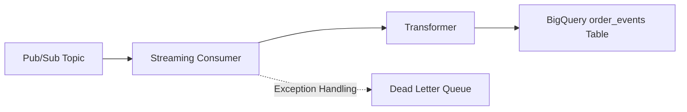

# RCA Assignment Pipelines Overview

This document provides a concise explanation of the three main pipelines in the RCA assignment: Streaming, Aggregation, and Activation.

---

## 1. Streaming Pipeline

**Flow:** Pub/Sub → Transformer → BigQuery



**Description:**
- Receives real-time order events from Pub/Sub.
- Transforms them into a standardized schema.
- Writes transformed events into the `order_events` BigQuery table.
- Failed events are routed to a Dead Letter Queue.

---

## 2. Aggregation Pipeline

**Flow:** order_events → Consolidation → orders

```mermaid
flowchart LR
    A[BigQuery order_events Table] --> B[Aggregation (SQL / ETL)]
    B --> C[BigQuery orders Table]
```

**Description:**
- Aggregates multiple events per order to maintain only the latest status.
- SQL Scheduled Query (`consolidate.sql`) or Python ETL (`etl.py`) can be used.
- Produces the `orders` table partitioned by creation date for efficient querying.

---

## 3. Activation Pipeline

**Flow:** orders → Google Ads conversion upload

```mermaid
flowchart LR
    A[BigQuery orders Table] --> B[Google Ads Upload (google_ads_upload.py)]
    B --> C[Google Ads Conversion Campaign]
```

**Description:**
- Reads completed orders from the consolidated `orders` table.
- Prepares conversion payloads with required fields (`gclid`, `conversion_action`, `conversion_date_time`, `conversion_value`, `currency_code`).
- Mocks upload to Google Ads for campaign attribution.
- Supports automation and can be tested locally.
